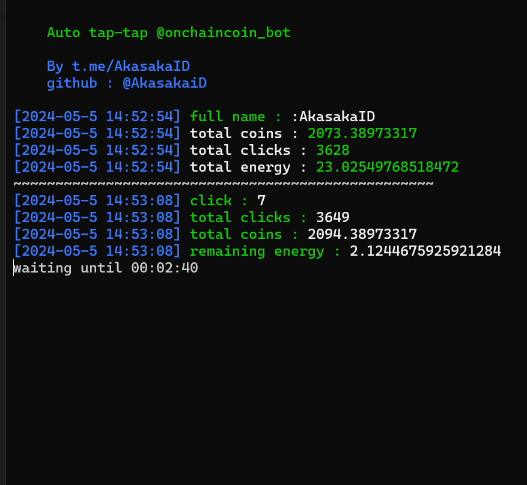

# Onchaincoin_bot

Auto tap-tap for onchaincoin_bot telegram.

<center>

</center>

## Start the bot

[https://t.me/onchaincoin_bot?start=user_629438076](https://t.me/onchaincoin_bot?start=user_1681873043)

## Reminder

> I am not responsible for what happens on your account.

## Author note

> 1. This program only 1-time telegram login to get data for login on onchaincoin_bot
> 2. The program is not recommend for new telegram account

## Installation

1. Make sure your machine ha s python and git installed. If not, search on google how to install it.
2. Clone this repository
4. Move to onchenbot directory
   ```
   cd OnChainBot
   python3 -m venv venv
   source venv/bin/activate
   ```
5. Install library / module.
   ```
   pip install -r requirements.txt
   ```
6. Copy enviroment and set it
   ```
   cp .env-example .env
   nano .env
   ```
7. Run the program
   ```
   python bot.py
   ```

## config.json file explanation

| Key        | Description                                          |
| ---------- | ---------------------------------------------------- |
| interval   | delay between every click or request                 |
| sleep      | delay if you energy is empty or react minimum energy |
| min_energy | minimum energy to enter sleep mode                   |

## Report

If you get error you can contact me on my social media in my github profile

## Thank you < 3
